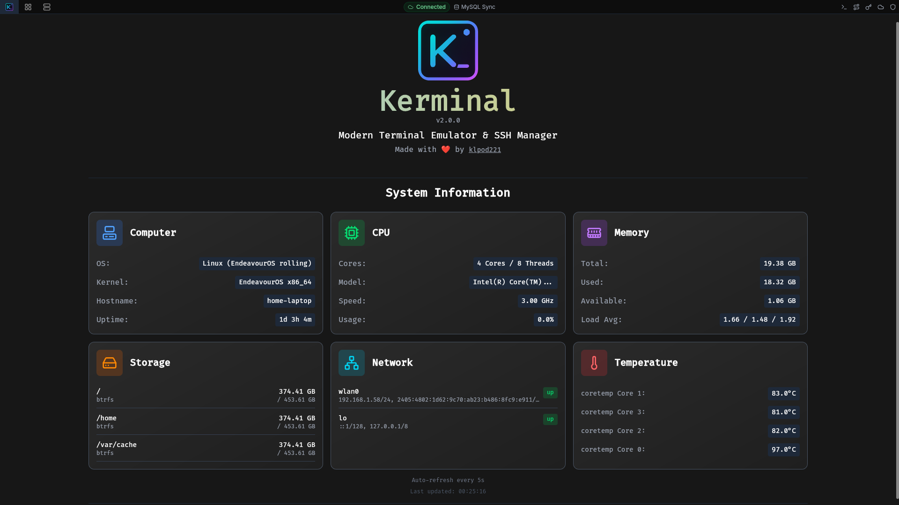
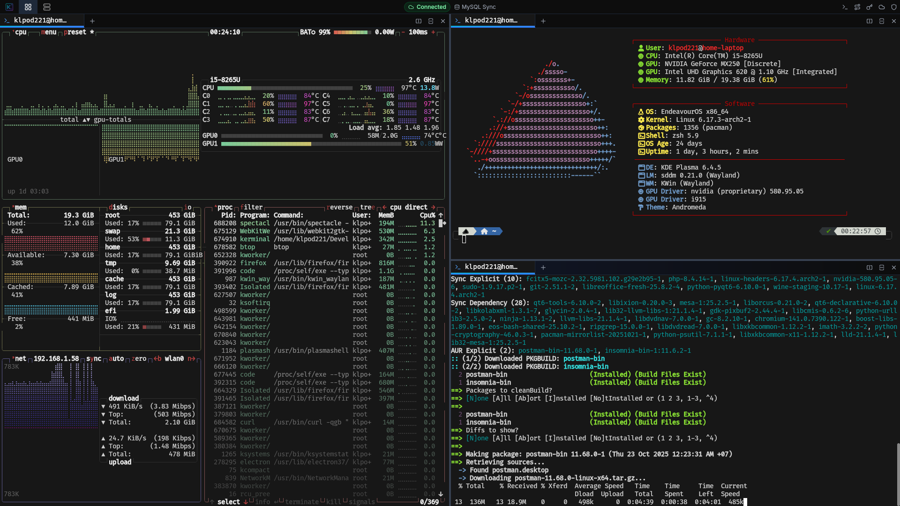

<div align="center">
    <h1>Kerminal: Modern Terminal Emulator & SSH Manager</h1>
    <p>A powerful, feature-rich terminal emulator with advanced SSH management, multi-device sync, and enterprise-grade encryption built with Tauri + Vue 3.</p>
    
    
    
    
</div>

## 📝 Description

**Kerminal** is a modern, high-performance terminal emulator that combines the power of a full-featured local terminal with advanced SSH connection management. Built with security-first architecture using Tauri (Rust) for native performance and Vue 3 for a responsive UI, Kerminal offers everything from basic terminal operations to complex SSH workflows with encrypted profile management, tunneling, and multi-device synchronization—all in a beautiful native desktop application.

Whether you need a powerful local terminal with multiple tabs and split panes, or a sophisticated SSH client for managing dozens of remote servers, Kerminal provides the perfect balance of simplicity and advanced features.

Perfect for developers, DevOps engineers, system administrators, and anyone who lives in the terminal and values security, organization, and productivity.

## 📸 Screenshots

### Dashboard



### Main Interface



## ✨ Features

### 💻 Terminal Emulator
- Multiple tabs and split panes with unlimited sessions
- Native shell integration (bash, zsh, fish, PowerShell, etc.)
- WebGL-accelerated rendering with Unicode 11 support
- Search, clickable links, clipboard integration
- Session persistence and custom working directories

### 📡 SSH Management
- Profile organization with groups, colors, and descriptions
- Multiple authentication methods (password, keys, agent, certificate, Kerberos, PKCS11)
- SSH key manager with import/export capabilities
- Connection testing and proxy support (HTTP, SOCKS4/5)
- Local/Remote/Dynamic port forwarding with auto-start

### 🔐 Security & Sync
- AES-256-GCM encryption with master password protection
- Device-specific keys and keychain integration
- Multi-device sync via MySQL/PostgreSQL/MongoDB
- Conflict resolution strategies and auto-lock sessions

### 💾 Saved Commands
- Command library with groups and descriptions
- Usage tracking, favorites, and quick access shortcuts
- Variable substitution for dynamic execution

### 🎨 User Interface
- Modern dark theme with responsive layout
- Keyboard shortcuts and customizable colors
- Real-time status indicators for sync and tunnels

### 📡 SSH Features
- **Profile Management**: Organize SSH connections with groups, colors, and descriptions
- **Multiple Authentication Methods**:
  - Password authentication
  - Private key (RSA, Ed25519, ECDSA, DSA)
  - SSH agent forwarding
  - Certificate-based authentication
  - Kerberos and PKCS11 support
- **SSH Key Manager**: Create, import, and manage SSH keys with passphrases
- **Connection Testing**: Verify SSH profiles before connecting
- **Proxy Support**: HTTP, SOCKS4, and SOCKS5 proxy configurations
- **Advanced Options**: Custom ports, keep-alive settings, compression, and more

### 🔀 SSH Tunneling
- **Local Port Forwarding**: Access remote services on local machine
- **Remote Port Forwarding**: Expose local services to remote networks
- **Dynamic Port Forwarding**: SOCKS proxy for routing traffic through SSH
- **Auto-Start Tunnels**: Automatically establish tunnels on application launch
- **Status Monitoring**: Real-time tunnel status with error handling

### 💾 Saved Commands
- **Command Library**: Store frequently used commands with descriptions
- **Command Groups**: Organize commands by category or purpose
- **Usage Tracking**: Track command usage frequency and favorites
- **Quick Access**: Execute saved commands with keyboard shortcuts
- **Variable Substitution**: Use placeholders for dynamic command execution

### 🔄 Multi-Device Sync
- **Database Providers**: Sync via MySQL, PostgreSQL, or MongoDB
- **Encrypted Transmission**: All sync data encrypted with AES-256-GCM
- **Conflict Resolution Strategies**:
  - Last Write Wins
  - First Write Wins
  - Manual resolution with detailed conflict view
  - Local/Remote priority modes
- **Sync Direction Control**: Push, Pull, or Bidirectional sync
- **Device Management**: Track and manage devices accessing your data
- **Automatic Sync**: Configurable auto-sync intervals

### 🎨 User Interface
- **Modern Dark Theme**: Easy on the eyes for long terminal sessions
- **Responsive Layout**: Adaptive UI for different screen sizes
- **Keyboard Shortcuts**: Efficient navigation and command execution
- **Customizable**: Profile colors, group organization, and layout preferences
- **Status Indicators**: Visual feedback for sync status, tunnel status, and connection health

## Installation Guide

### Arch Linux (install from AUR)

- Using an AUR helper (e.g., yay):

```bash
yay -S kerminal # or kerminal-bin
```

- Manually:

```bash
git clone https://aur.archlinux.org/kerminal.git # or kerminal-bin.git
cd kerminal
makepkg -si
```

### Other Platforms (Windows, macOS, Linux)

1. **Download**
  - Get the latest release from the [Releases](https://github.com/klpod221/kerminal/releases/latest) page.

2. **Install**
  - Follow the installation instructions for your operating system (see below).

## 🚀 Development

### Prerequisites
- **Node.js** (v20 or higher)
- **Rust** (latest stable)
- **Tauri CLI**: `cargo install tauri-cli`

### Installation

1. **Clone the repository**
```bash
git clone https://github.com/klpod221/kerminal.git
cd kerminal
```

2. **Install dependencies**
```bash
npm install
```

3. **Run in development mode**
```bash
npm run tauri dev
```

4. **Build for production**
```bash
npm run tauri build
```

The application will be available in `src-tauri/target/release/bundle/`.

## 📖 Usage

### Initial Setup

1. **Master Password**: On first launch, create a master password to encrypt your data
2. **Auto-Unlock** (Optional): Enable keychain integration for automatic unlocking
3. **SSH Profiles** (Optional): Add your SSH connection profiles with credentials
4. **External Database** (Optional): Configure MySQL/PostgreSQL/MongoDB for multi-device sync

### Using as Terminal Emulator

1. **New Local Terminal**: Click the "+" button or use keyboard shortcut
2. **Split Panes**: Right-click on a terminal to split horizontally or vertically
3. **Multiple Tabs**: Organize different projects or tasks in separate tabs
4. **Custom Shell**: Configure your preferred shell in terminal settings
5. **Working Directory**: Start terminals in project directories for quick access

### Creating SSH Connections

1. Navigate to **SSH Profiles** manager
2. Click **Add Profile** and configure:
   - Connection details (host, port, username)
   - Authentication method (password, key, agent)
   - Optional: Group, color, description
   - Advanced settings (compression, keep-alive, proxy)
3. **Test Connection** to verify settings
4. **Save** profile

### SSH Tunneling

1. Open **Tunnel Manager**
2. Create tunnel with:
   - SSH profile selection
   - Tunnel type (Local/Remote/Dynamic)
   - Port configurations
   - Auto-start option
3. Start/stop tunnels as needed
4. Monitor status in real-time

### Multi-Device Sync

1. Configure external database in **Sync Settings**
2. Choose conflict resolution strategy
3. Enable auto-sync or trigger manually
4. Manage connected devices
5. Resolve conflicts when they occur

## 🛠️ Development

### Project Structure

- **Frontend**: Vue 3 with Composition API, Pinia stores, TypeScript
- **Backend**: Rust with Tauri v2, async/await with Tokio
- **Terminal**: xterm.js with WebGL renderer and addons
- **SSH**: russh library for SSH protocol implementation
- **Database**: SQLx for SQL databases, MongoDB driver for NoSQL
- **Encryption**: AES-GCM with Argon2 key derivation

### Key Technologies

| Layer | Technology | Purpose |
|-------|-----------|---------|
| Frontend | Vue 3 + TypeScript | Reactive UI framework |
| State | Pinia | Centralized state management |
| Backend | Rust + Tauri v2 | Native performance and security |
| SSH | russh | SSH protocol implementation |
| Terminal | xterm.js | Terminal emulation |
| Database | SQLite, MySQL, PostgreSQL, MongoDB | Local and sync storage |
| Encryption | AES-256-GCM + Argon2 | Data encryption and key derivation |

### Code Quality

```bash
# Format code
npm run pretty

# Type checking
npm run build

# Full development build
npm run tauri dev
```

### Design Patterns

- **Dependency Injection**: Backend services use Arc<Mutex<T>> pattern
- **Service Layer**: Clean separation between UI, business logic, and data access
- **State Management**: Centralized Pinia stores with computed properties
- **Error Handling**: Comprehensive try/catch with user-friendly messages

## 📊 Performance

- **Efficient Buffer Management**: Circular buffer for terminal history with memory limits
- **Connection Pooling**: Reuse SSH connections for better performance
- **Lazy Loading**: Components and data loaded on demand
- **Optimized Rendering**: WebGL-accelerated terminal with efficient updates
- **Background Processing**: Async operations don't block UI

## 🔒 Security Considerations

- All sensitive data encrypted at rest with AES-256-GCM
- Master password never stored, only verification hash
- Device-specific encryption keys prevent data access from other devices
- SSH private keys never leave the device unencrypted
- Sync data encrypted before transmission
- Automatic session locking after inactivity
- Platform keychain integration for secure auto-unlock

## 🤝 Contributing

Contributions are welcome! Please follow these guidelines:

1. Fork the repository
2. Create a feature branch (`git checkout -b feature/amazing-feature`)
3. Commit your changes (`git commit -m 'Add amazing feature'`)
4. Push to the branch (`git push origin feature/amazing-feature`)
5. Open a Pull Request

### Development Guidelines

- Follow the existing code style and patterns
- Use TypeScript for frontend code
- Write clear, self-documenting code
- Test SSH connections and sync functionality
- Follow SOLID principles
- Keep components focused and reusable

## 📝 License

This project is licensed under the MIT License - see the [LICENSE](LICENSE) file for details.

## 👤 Author

**Bùi Thanh Xuân (klpod221)**

- Website: [klpod221.com](https://klpod221.com)
- GitHub: [@klpod221](https://github.com/klpod221)
- Email: klpod221@gmail.com
- Facebook: [Bùi Thanh Xuân](https://www.facebook.com/klpod221)

## 🙏 Acknowledgments

- **Tauri** - For the amazing Rust-based desktop framework
- **Vue 3** - For the reactive and performant frontend framework
- **xterm.js** - For the excellent terminal emulator
- **russh** - For the robust SSH implementation in Rust
- **Lucide** - For the beautiful icon set

## 📮 Support

If you encounter any issues or have questions:

1. Check existing [Issues](https://github.com/klpod221/kerminal/issues)
2. Create a new issue with detailed information
3. Contact via email: klpod221@gmail.com

## 🗺️ Roadmap

- [ ] SFTP file transfer integration
- [ ] Session recording and playback
- [ ] Custom themes and color schemes
- [ ] Plugin system for extensions
- [ ] Snippet manager with syntax highlighting
- [ ] Cloud backup integration
- [ ] Web-based version
- [ ] Mobile app companion

---

<div align="center">
    <p>Made with ❤️ by klpod221</p>
    <p>⭐ Star this repository if you find it helpful!</p>
</div>
